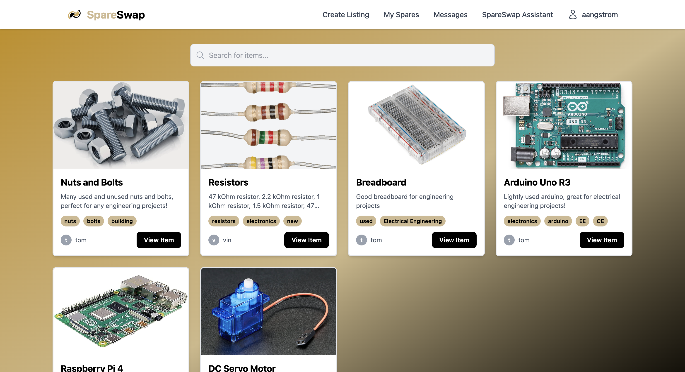

# 🔧 Spare Swap

[Spare Swap](https://spare-swap.netlify.app/) is a Purdue-themed web application that allows students to list, browse, and request spare engineering parts such as resistors, breadboards, Arduino boards, and more. The platform includes authentication, item management, messaging between users, and an AI-powered assistant to help students with project ideas. Built with modern web technologies, it provides a simple and efficient way to list, request, and swap items.

---

## 📦 Tech Stack

- **Vite** – Lightning fast development build tool
- **React** – Frontend library for building UI components
- **Tailwind CSS** – Utility-first CSS framework for styling
- **Supabase** – Backend as a service (Postgres, Auth, Storage, Realtime)
- **OpenAI API** – AI-powered features for smarter item descriptions and search

---

## 🔑 Features

- ✅ User authentication & profiles via Supabase  
- ✅ Real-time listings, updates, and messaging  
- ✅ Responsive design with Tailwind CSS  
- ✅ AI-powered item descriptions & recommendations using OpenAI  
- ✅ Fast builds and hot-reload dev server with Vite  

---

## 🚀 Features

* **Authentication** – Secure sign in with email (Purdue-specific login supported).
* **Listings** – Create, browse, and manage spare parts listings with images, descriptions, and tags.
* **Search & Filters** – Quickly search for available items by keywords or tags.
* **Messaging System** – Request items and chat with other students to coordinate exchanges.
* **My Items Dashboard** – Manage your own listings and track requests.
* **SpareSwap Assistant** – AI-powered project assistant that helps generate ideas for using spare parts.

---

## 🛠️ Tech Stack

* **Frontend**: [React](https://react.dev/) with [Vite](https://vitejs.dev/)
* **Database & Auth**: [Supabase](https://supabase.com/)
* **Styling**: [Tailwind CSS](https://tailwindcss.com/)
* **Deployment**: Works with services like Netlify or Vercel

---

## Screens
* **📸 Screenshots**

* **🔐 Authentication**

* **📦 Browse Items**

* **➕ Create Listing**

* **📂 My Items**

* **💬 Messaging**

* **🤖 SpareSwap Assistant**

---

## 🔮 Future Improvements

* Add real-time notifications for new requests and messages.
* Mobile-first UI optimization.
* Rating system for reliable swappers.

---

## 🤝 Contributing

Contributions are welcome! Please fork this repository and submit a pull request with your improvements.

